# Media Analysis Solution (MAS)

In this module you will deploy [Media Analysis Solution](https://aws.amazon.com/answers/media-entertainment/media-analysis-solution/); a serverless reference implementation to extract metadata from media files. You will then extract metadata from sample media files, and store resulting metadata for future search and analysis.

## Solution Architecture


1. When new media files are uploaded to the Amazon Simple Storage Service (Amazon S3) media analysis bucket, an AWS Lambda function invokes the AWS Step Functions state machine. Metadata is extracted by Amazon Rekognition, Amazon Transcribe, and Amazon Comprehend.

2. When an MP4 video file is uploaded, AWS Elemental MediaConvert extracts audio for the analysis by Amazon Transcribe and Amazon Comprehend.

3. Another Lambda function retrieves, processes, and stores the results in the Amazon S3 bucket and an Amazon Elasticsearch cluster. The resulting metadata can be authenticated, securely searched, and retrieved using Amazon Cognito and an Amazon API Gateway RESTful API.  

4. The solution also deploys a static Amazon S3 web interface that customers can use to immediately start uploading, analyzing, and interacting with small media files.  

## Deploy Media Analysis Solution using CloudFormation Stack

1. Click on one of the buttons below to launch CloudFormation stack one of the AWS regions.

Region| Launch
------|-----
US East (N. Virginia) | [](https://console.aws.amazon.com/cloudformation/home?region=us-east-1#/stacks/new?stackName=MediaAnalysis&templateURL=https:%2F%2Fs3.amazonaws.com%2Fsolutions-reference%2Fmedia-analysis-solution%2Flatest%2Fmedia-analysis-deploy.template)
US East (Ohio) | [](https://console.aws.amazon.com/cloudformation/home?region=us-east-2#/stacks/new?stackName=MediaAnalysis&templateURL=https:%2F%2Fs3.amazonaws.com%2Fsolutions-reference%2Fmedia-analysis-solution%2Flatest%2Fmedia-analysis-deploy.template)
US West (Oregon) | [](https://console.aws.amazon.com/cloudformation/home?region=us-west-2#/stacks/new?stackName=MediaAnalysis&templateURL=https:%2F%2Fs3.amazonaws.com%2Fsolutions-reference%2Fmedia-analysis-solution%2Flatest%2Fmedia-analysis-deploy.template)
EU (Ireland) | [](https://console.aws.amazon.com/cloudformation/home?region=eu-west-1#/stacks/new?stackName=MediaAnalysis&templateURL=https:%2F%2Fs3.amazonaws.com%2Fsolutions-reference%2Fmedia-analysis-solution%2Flatest%2Fmedia-analysis-deploy.template)

2. Click **Next** on the Select Template page.

3. Enter a **valid email address**. You will receive log-in information and notifications at this email address after the CloudFormation template is complete. Leave the Elasticsearch cluster size to be **Small** and click **Next**.

  ```
  NOTE: Make sure you enter a valid email address. You will receive credentials and URL to login to the web app for Media Analysis Solution at this email address.
  ```
    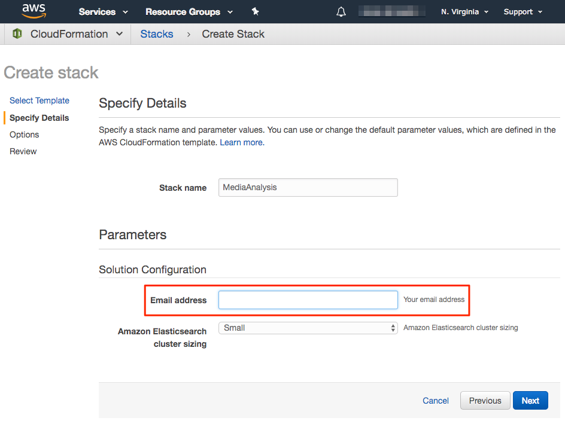

4. On the Options page, leave all the defaults and click **Next**.

5. On the Review page, check the box to acknowledge that CloudFormation will create IAM resources and click **Create**.
    

6. Click on Stacks in  the top navigation to to CloudFormation Stack screen. You should MediaAnalysis CloudFormation template in progress.

7. MediaAnalysis CloudFormation template will create 3 additional nested stacks - `MediaAnalysisStateMachineStack`, `MediaAnalysisApiStack`, and `MediaAnalysisStorageStack`. Wait until the status of all four stack reach to `CREATE_COMPLETE`. You can click refresh icon at the top right to get current status of CloudFormation stacks.

**Note: It can take up to 20 minutes for CloudFormation to complete.**

8. Select the Stack - `Media Analysis`, and click on the **Resources** tab from the bottom pane. You will see various AWS resources including S3 buckets, IAM roles, Lambda functions etc. that CloudFormation created.


## Access Media Analysis Solution

After the CloudFormation template is complete, you should receive a welcome email at the email address you provided, with the subject line `Your Media Analysis Solution demo login`. In this section, you will use the link and Username/Password provided in the email to access the Media Analysis Solution user interface.

  ```
  If you did not receive email about your Media Analysis Solution instance, check spam/junk folder in your email.
  ```

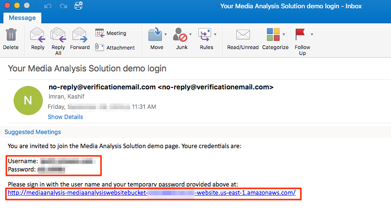

1. Click on the link in the email, and use Username and Password in the email to sign in to the application.

2. After you sign in, MAS will prompt you to choose a new password. Enter a new password to continue to MAS landing page.

3. You should see the landing page of the Media Analysis Solution, displaying a getting started guide and an overview of the solution architecture.

    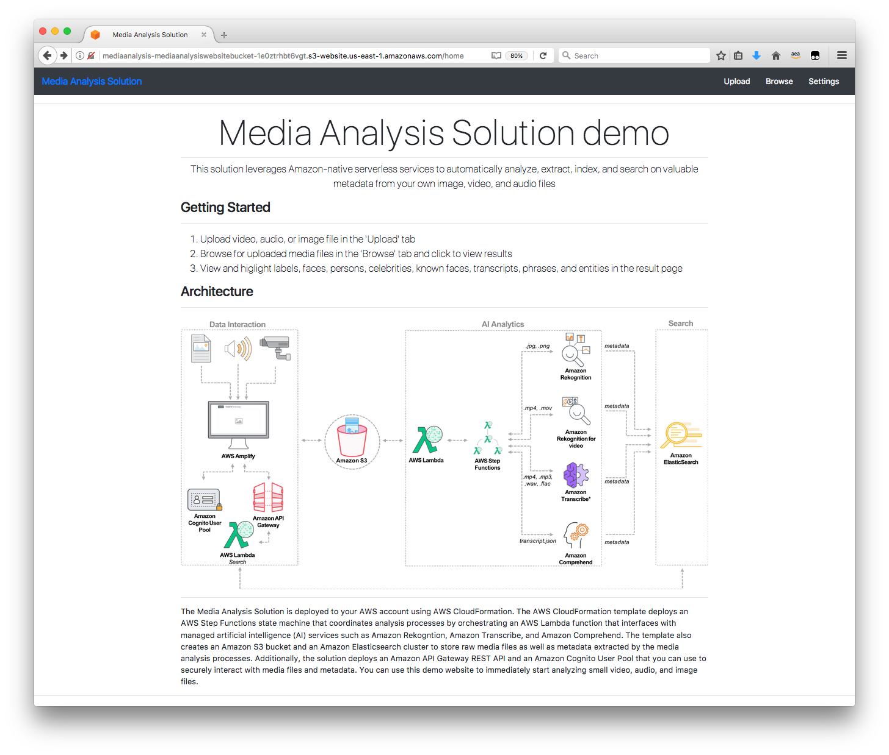

## Analyze Images using Media Analysis Solution

1. Download and save [sample image](sample-images/picnic.jpg) on your desktop.

2. In MAS, click on the **Upload** link from the top menu.

3. Under **Analyze new Media**, click on Choose File, select the image you downloaded in earlier step and click "Upload Media".

4. You should get a dialog as below showing progress of image analysis using different Rekognition APIs.


5. In few seconds as the image is processed, you should get dialog as shown below.

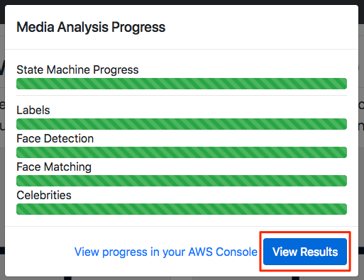

6. Click on **View Results** button to view the extracted metadata for the image.

7. You will see different tabs showing labels for detected objects, faces and celebrities.

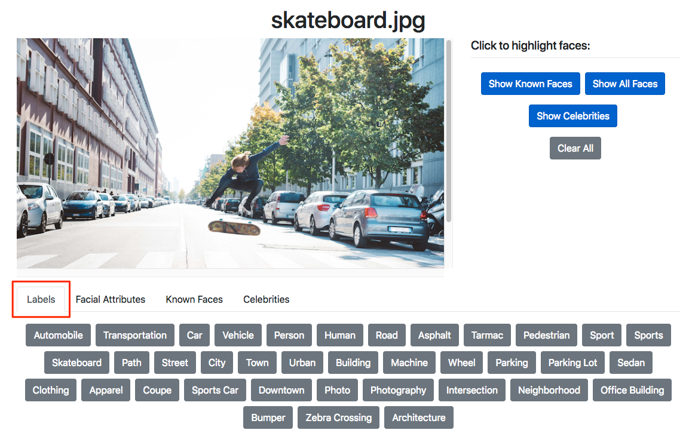

## Analyze Image and View Progress Workflow

1. Download and save [sample image](sample-images/drive.jpg) image on your desktop.

2. In MAS, click on the **Upload** link from the top menu.

3. Under **Analyze new Media**, click on Choose File, select the image you downloaded in earlier step and click "Upload Media".

4. You should get a dialog as shown below showing progress of various stages of image analysis process.


5. Click on **View Progress in your AWS Console** to go to StepFunction in AWS Console.

6. Under Visual workflow, click on expand button to get maximized view of the workflow.

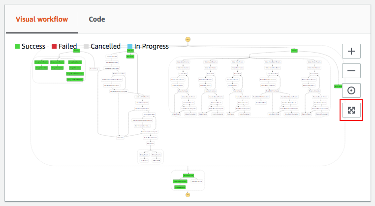

7. Visual workflow shows how appropriate workflow steps are executed depending on the type of the media (Image, Audio or Video). Different stages in the workflow call different Lambda functions to perform tasks for that stage.[MAS Code](https://github.com/awslabs/media-analysis-solution/blob/master/source/analysis/lib/index.js) shows how depending on the input media type step function is triggered.

```node

  /**
   * Triggered by S3 Put event
   */

   if (event.Records[0].eventSource == 'aws:s3'){
      let media_key = decodeURIComponent(event.Records[0].s3.object.key.replace(/\+/g, ' '));
      let media_formats = ['mov','mp4','jpeg','jpg','png','wav','wave','mp3','flac'];

      if (media_key.split('/')[4] == 'content' && media_formats.includes(media_key.split('.').pop())) {
          console.log('New media uploaded:', JSON.stringify(event, null, 2));

          let event_info = {
              ...
              file_type: media_key.split('.').pop(),
              ...
          };

          steps.respond(event_info, function(err, data) {
              if (err) {
                  return cb(err, null);
              }
              else {
                  return cb(null, data);
              }
          });
}
```

8. Go back to previous screen and Click on Code. You will see references different Lambda functions which call various Rekognition APIs to detect labels, faces, celebrities etc.

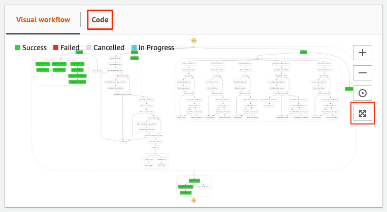

```json
  "Image-Get Labels": {
             "Type": "Task",
             "Resource": "arn:aws:lambda:us-east-1:xxxxxxxx:function:MediaAnalysis-MediaAnalysisFunction-xxxxxxxx",
             "InputPath": "$",
             "ResultPath": "$.results.labels",
             "End": true
             }
```

8. [image.js](https://github.com/awslabs/media-analysis-solution/blob/master/source/analysis/lib/image/image.js) shows node code to process images.

9. MAS stores extracted metadata for each media file in a JSON file in S3 bucket along with the media file. To view metadata JSON file, go to S3 and search media.


10. Click on the S3 bucket that starts with media-analysis and go to private -> folder with guid in it -> media


11. You will see folder with guid as their names for each object uploaded to MAS. Click on a folder and go inside nested folder results. You will see JSON files containing metadata for different Rekognition API  calls.


## Analyze Videos using Media Analysis Solution

### Add face to Rekognition Collection
In addition to analyzing media, MAS enables you to upload faces to an Amazon Rekognition collection so that they are automatically recognized in any uploaded media.

1. Download and save [sample image of Matt Wood](sample-images/mattwood.jpg) on your desktop.

2. Under **Add to Collection**, upload the image you just downloaded by selecting "Choose File" (or Browse for those on a Mac).

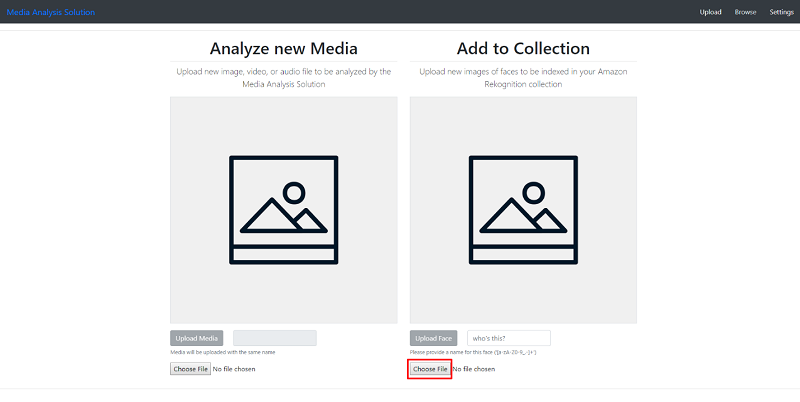

3. Next, name the image “mattwood” and choose Upload Face.

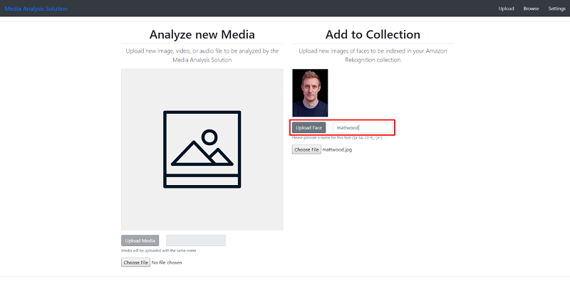

### Upload Video

1. Download and save [sample video](sample-videos/reinvent-2017-matt-wood.mp4) on your desktop.

2. In MAS, click on the **Upload** link from the top menu.

3. Under **Analyze new Media**, click on Choose File, select the video you downloaded in earlier step and click "Upload Media".

4. You should get a dialog as shown below showing progress of various stages of image analysis process.


5. Click on **View Progress in your AWS Console** to go to StepFunction in AWS Console.

6. Under Visual workflow, click on expand button to get maximized view of the workflow.

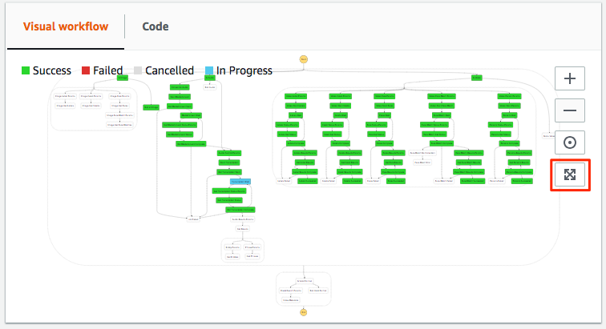

7. You should different stages turn green as workflow progresses.

8. Choose Browse on the Media Analysis Solution page and click "View Results" for the video you just uploaded.


9. You will see extracted metadata includes labels, facial attributes, known faces, and celebrities from Amazon Rekognition; a transcript from Amazon Transcribe; and entities and phrases from Amazon Comprehend. Choose Known Faces and you’ll see that Matt Wood has been recognized since we added him to the Amazon Rekognition collection before we analyzed this video. This feature can be extremely useful for common media use cases that require identification of multiple individuals.

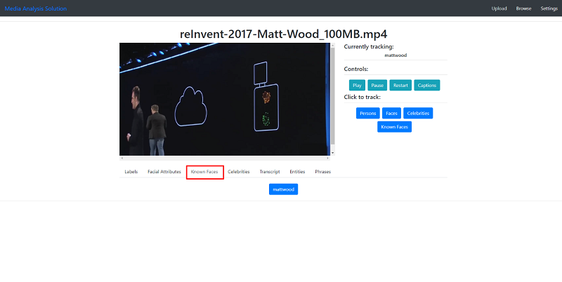

10. Choose Entities and see that Amazon Comprehend has identified artists from Matt’s presentation, such as Rick Astley and Eric Clapton.

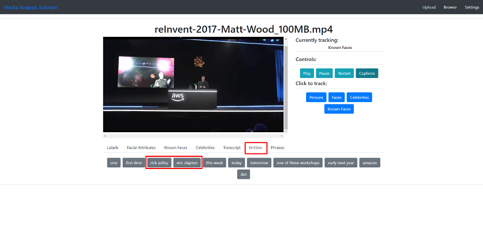

11. [video.js](https://github.com/awslabs/media-analysis-solution/blob/master/source/analysis/lib/video/video.js) shows how Media Analysis Solution calls different Rekognition APIs to start videos analysis. [results.js](https://github.com/awslabs/media-analysis-solution/blob/master/source/analysis/lib/video/results.js) contains the core logic to then get the metadata from Rekognition after the analysis job is complete.

12. MAS stores extracted metadata for each media file in a JSON file in S3 bucket along with the media file. To view metadata JSON file, go to S3 and search media.


13. Click on the S3 bucket that starts with media-analysis and go to private -> folder with guid in it -> media


14. You will see folder with guid as their names for each object uploaded to MAS. Click on a folder and go inside nested folder results. You will see JSON files containing metadata for different Rekognition API  calls.


## Completion
You have successfully deployed Media Analysis Solution, and analyzed media files. In the next module, [Content Moderation](../2-ContentModeration), you will learn how to extend Media Solution to detect and filter inappropriate content.
