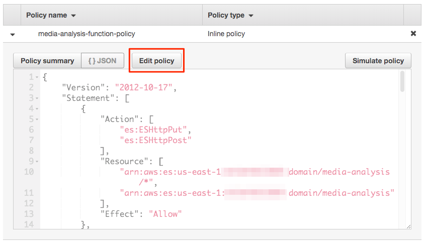
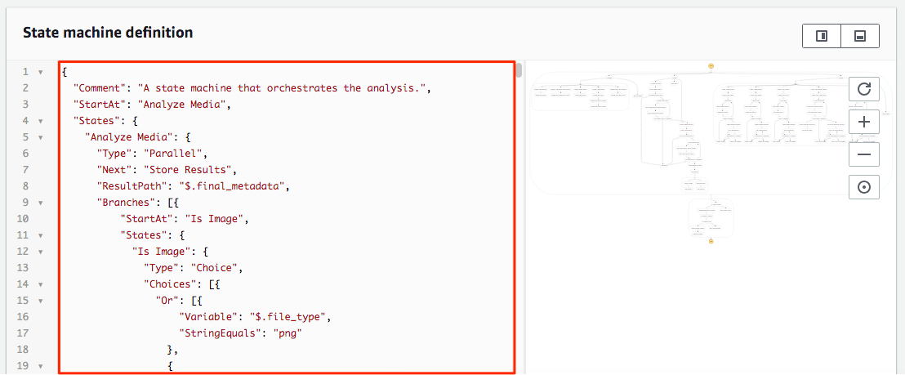

# Content Moderation

In this module you will extend the Media Analysis Solution to extract text from the images and then moderate images with explicit or suggestive content and offensive language. After you complete this module, your solution will automatically detect and isolate un-safe content as it is uploaded.

We will be using [DetectModerationLabels](https://docs.aws.amazon.com/rekognition/latest/dg/API_DetectModerationLabels.html) and [DetectText](https://docs.aws.amazon.com/rekognition/latest/dg/API_DetectText.html) APIs of Amazon Rekognition to perform content moderation.

To enhance the solution, you will modify three components of the solution:

  1. Media Analysis Lambda Function - Add code to detect text, moderation labels and then analyze the extracted meta-data for un-safe content.

  2. IAM Role for Media Analysis Lambda Function - Give IAM role the permissions to call the DetectModerationLabels and DetectText API.

  3. Media Analysis Step Functions - Modify the step functions to change the workflow to detect, isolate un-safe images as they are uploaded.

## Step 1 - Modify Media Analysis Lambda Function

In this step, you will modify the Media Analysis Lambda Function to make calls to Rekognition DetectModerationLabels API and notify the admin if un-safe content is detected

1. [Download](./code/lambda.zip) packaged lambda code on your local machine. This lambda function has been updated to include logic for content moderation.

2. Go to lambda console at https://console.aws.amazon.com/lambda/home.

3. In the add filter type media and you should see lambda functions that are part of Media Analysis Solution.

4. Click on the lambda function with description "AWS Lambda function to execute analysis".

  ```
  Ensure that you are selecting the correct lambda function, as you do not want to write a different lambda function that is part of the solution.
  ```
5. Under Function Code, click on Upload and select the zip file you downloaded earlier.

6. Click Save to upload the new lambda code.

7. Under Environment Variables create two environment variables as below:
  - Key: moderate_label_keywords    Value: ocean,sun
  - Key: moderate_text_keywords     Value: sun,filter

8. Click on Save to save the environment variables.

  **You have successfully completed step 1!**

## Step 2 - Add permissions to IAM Role

In this step you will provide the Media Analysis Lambda Function necessary permissions to call the Rekognition DetectModerationLabels and DetectText APIs.

1. Go to the CloudFormation console https://console.aws.amazon.com/cloudformation/home

2. Click on the stack with Stack Name - `Media Analysis`, select **Resources** tab from the bottom pane and navigate to Media Analysis Function Role. Click on the hyperlink to open the IAM Role

  

3. On summary screen, under Permissions tab, click on the arrow to view details of the policy "media-analysis-function-policy".

  

4. Click on Edit Policy



5. Expand Rekognition, and hover over Actions to get the edit icon and then click on it.


6. Select DetectModerationLabels and DetectText and click on the button Review policy.


7. Under Review policy, click Save changes.


**You have successfully completed step 2 and updated IAM role to allows Lambda function to call additional Rekognition APIs.**

## Step 3 - Modify Media Analysis Step Function

In this step, you will modify the Media Analysis Step Function to orchestrate the Lambda function calls.

1. Go to AWS Step function console at https://console.aws.amazon.com/states/home

2. In the left navigation click on State Machines and type **media** in the search box. You will see state machine for your instance of Media Analysis Solution. Click on the state machine.


3. Click Edit to update the state machine.


4. Under State machine definition, copy the JSON of your state machine.



5. Use an editor of your choice to replace "REPLACE-WITH-ARN-OF-YOUR-LAMBDA-FUNCTION" with the arn of lambda function of your instance of Media Analysis Solution that you noted in step 1.


6. Replace JSON of you state machine definition with the updated JSON from your code editor and click Save.


7. In the right pane, you will see updated visual workflow showing update state machine.


  **You have successfully completed step 3 and updated state machine!**

## Testing it out

1. Save [sample image](sample_images/small_yoga_swimwear.jpg)  on your local machine.

2. Upload the image you just saved to the Media Analysis web portal.

3. Click on View progress to see the updated workflow. Notice image did not get indexed as the solution found un-safe content.

4. Go to s3 and you will contentModerationWarning.json with details from content moderation engine.

## Completion

You have successfully extended Media Analysis Solution to detect text and moderate un-safe content for images. You can use the same technique to update the workflow and lambda function to enable content moderation for videos.
