# Content Moderation

In this module you will extend the Media Analysis Solution to identify un-safe images including explicit or suggestive content or offensive text in the images. After you complete this module, your solution will automatically detect and isolate un-safe content as it is uploaded.

We will use following Rekognition APIs to achieve comprehensive content moderation:  
- [Labels](https://docs.aws.amazon.com/rekognition/latest/dg/API_DetectLabels.html): to identify objects of interest
- [DetectModerationLabels](https://docs.aws.amazon.com/rekognition/latest/dg/API_DetectModerationLabels.html): to identify explicit and suggestive content
- [DetectText](https://docs.aws.amazon.com/rekognition/latest/dg/API_DetectText.html): to identify profane text

To enhance the solution, you will modify three components of the solution:

  1. **Media Analysis Lambda Function**: Add code to detect text, moderation labels and then analyze the extracted meta-data for un-safe content.

  2. **IAM Role for Media Analysis Lambda Function**: Give IAM role the permissions to call the DetectModerationLabels and DetectText API.

  3. **Media Analysis Step Functions**: Modify the step functions to change the workflow to detect, isolate un-safe images as they are uploaded.

## Modify Media Analysis Lambda Function

In this step, you will modify the Media Analysis Solution lambda function to extract text from images and then use detected labels, text and moderation labels to identify un-safe content.

1. [Download](./code/lambda.zip) lambda package on your local machine. This lambda function has been updated to include logic for content moderation.

2. Unzip the file and review updated code as we have modified index.js and image.js as well as added content moderation module.

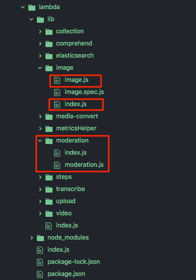

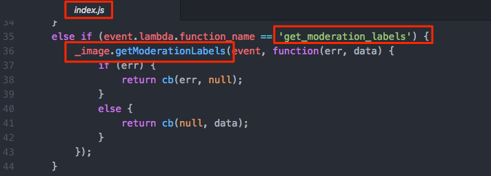

3. Go to the CloudFormation console https://console.aws.amazon.com/cloudformation/home

4. Click on the stack with Stack Name - `Media Analysis`, select **Resources** tab from the bottom pane and navigate to Media Analysis Function. Click on the hyperlink to open the Media Analysis Function.

  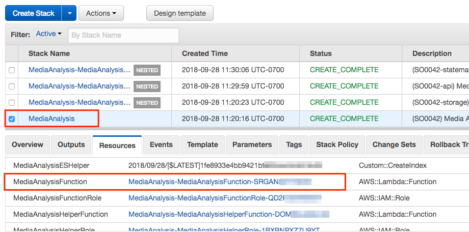

5. Under Function code, click on Upload button, select the zip file (lambda.zip) you downloaded in earlier step and click Save. It can take a minute to upload the zip file.

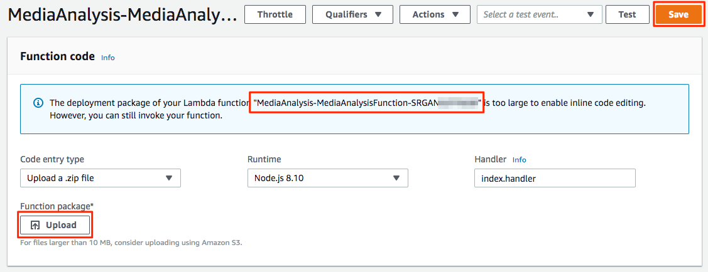

6. Under Environment variables, make following changes and click Save.
  - Update value of CONFIDENCE_SCORE to 50
  - Add two new environment variables:
     - Key: moderate_label_keywords
     - Value: bikini
     - Key: moderate_text_keywords
     - Value: crap, darn, damm

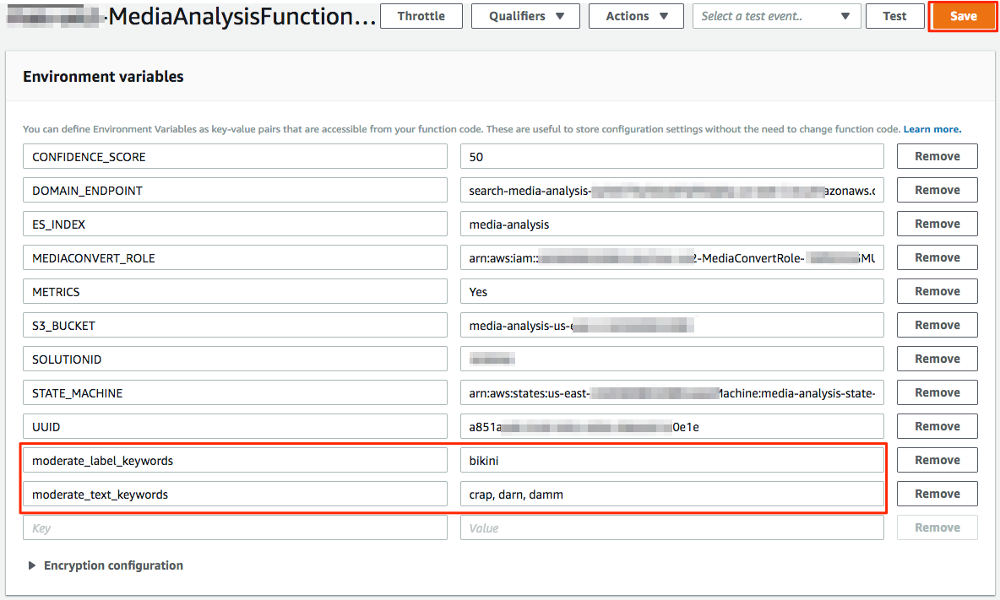

7. Make note of the arn of lambda function. You will need this in the step below as you modify state machine.

  **You have successfully completed step 1 and updated lambda function to perform additional analysis.!**

## Add permissions to IAM Role

In this step you will provide the Media Analysis Lambda Function necessary permissions to call the Rekognition DetectModerationLabels and DetectText APIs.

1. Go to the CloudFormation console https://console.aws.amazon.com/cloudformation/home

2. Click on the stack with Stack Name - `Media Analysis`, select **Resources** tab from the bottom pane and navigate to Media Analysis Function Role. Click on the hyperlink to open the IAM Role

  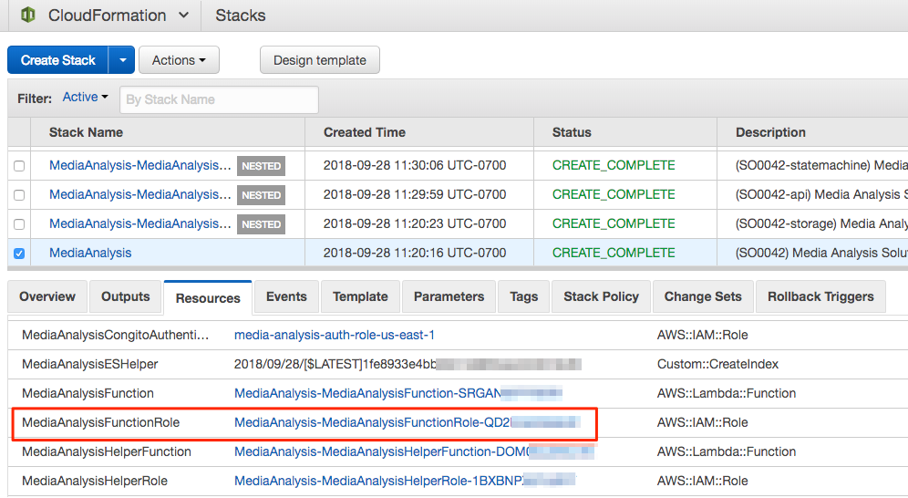

3. On summary screen, under Permissions tab, click on the arrow to view details of the policy "media-analysis-function-policy".

  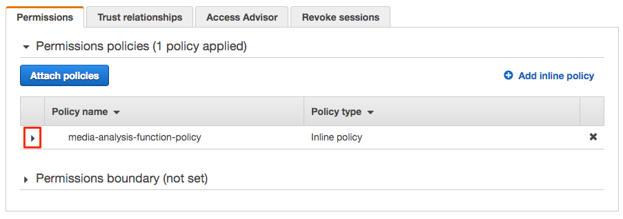

4. Click on Edit Policy

5. Expand Rekognition, and hover over Actions to get the edit icon and then click on it.

6. Select DetectModerationLabels and DetectText and click on the button Review policy.

7. Under Review policy, click Save changes.

**You have successfully completed step 2 and updated IAM role to allows Lambda function to call additional Rekognition APIs.**

## Modify Media Analysis Step Function

In this step, you will modify the Media Analysis Step Function to orchestrate the Lambda function calls.

1. Download [state machine JSON](code/step-function.json) on your local machine.

2. Use an editor of your choice to replace all instances of "REPLACE-WITH-ARN-OF-YOUR-LAMBDA-FUNCTION" with the arn of lambda function of your instance of Media Analysis Solution that you noted in step 1.

3. Go to AWS Step function console at https://console.aws.amazon.com/states/home

4. In the left navigation click on State Machines and type **media** in the search box. You will see state machine for your instance of Media Analysis Solution. Click on the state machine.

5. On the state machine details screen, click Edit to update the state machine.

6. Under State machine definition, replace JSON of you state machine definition with the updated JSON from your code editor and click Save.

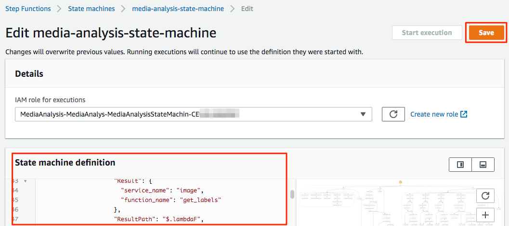

7. In the right pane, you will see updated visual workflow showing updated state machine.

  **You have successfully completed step 3 and updated state machine.**

## Testing it out

1. Download [sample image](assets/yoga-swimwear.jpg) on your local machine.

2. Go to the Media Analysis Portal, and upload the image you just saved.

3. Click on View progress link to go to your AWS Console in another tab. You can see in the visual workflow, image did not get indexed as the solution found it to be un-safe content.

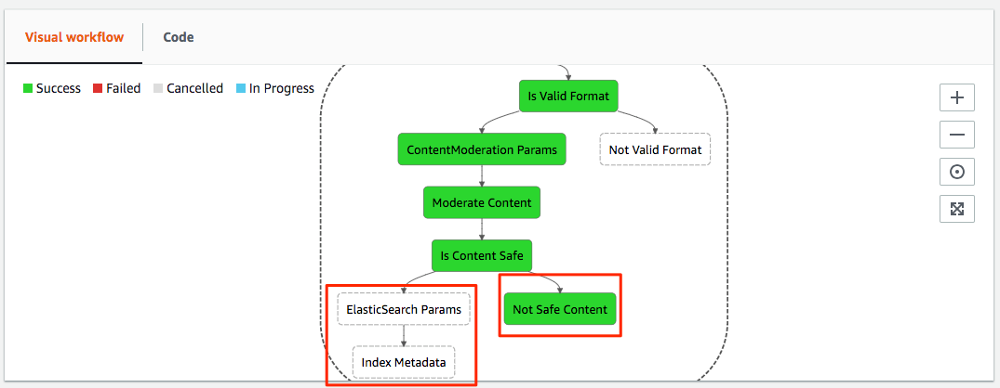

4. Under Visual workflow, click on "Not Safe Content" node and expand Output under Step details to see additional details.

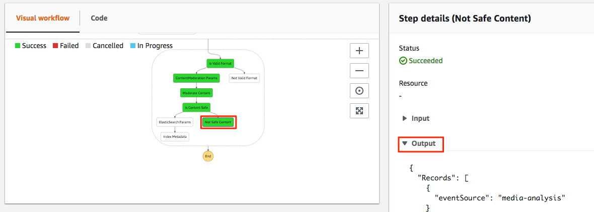

5. Scroll to the bottom of the output and you will see our custom moderation api identified 3 items of interest:
- bikini (detected by Rekognition Labels API)
- suggestive, female swimwear or underwear (detected by Rekognition Moderation API)
- crap, darn (text extract by Rekognition DetectText API)

6. Note "object_id" in the output and go to S3 bucket where content for your Media Analysis Solutions is uploaded. Locate the folder for the image you just uploaded (using the object_id from Step Function) and you will find contentModerationWarning.json.

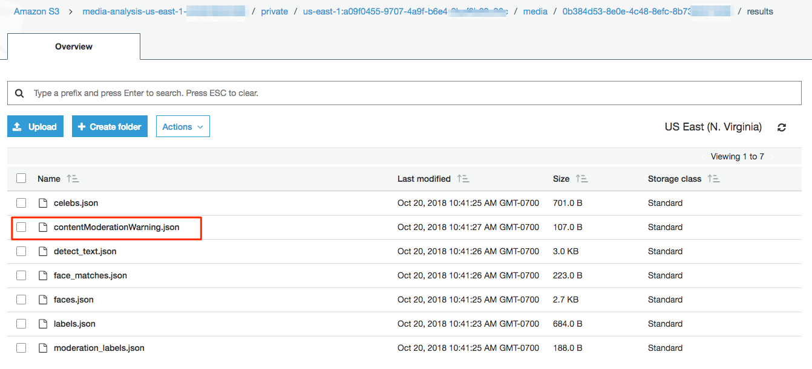

7. Download and open the JSON file contentModerationWarning.json and you should the message from content moderation engine about the nature of un-safe content.

8. If you you use "View Results" button for the test image you just uploaded, you will see error message as the image was not indexed because of moderation rules.

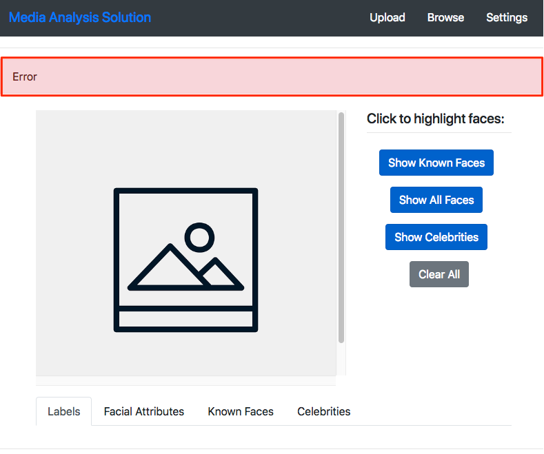

## Completion

You have successfully extended Media Analysis Solution to detect text and moderate un-safe content for images. You can use the same technique to update the workflow and lambda function to enable content moderation for videos.

## Clean up

1. Go to the CloudFormation console https://console.aws.amazon.com/cloudformation/home

2. Select stack with Stack Name - `Media Analysis`, click Actions and click on Delete Stack. This will also delete all the nested stacks.

  

3. Delete S3 buckets created by Media Analysis Solution.

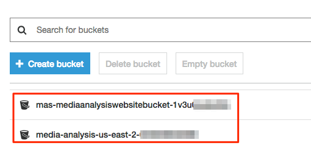
